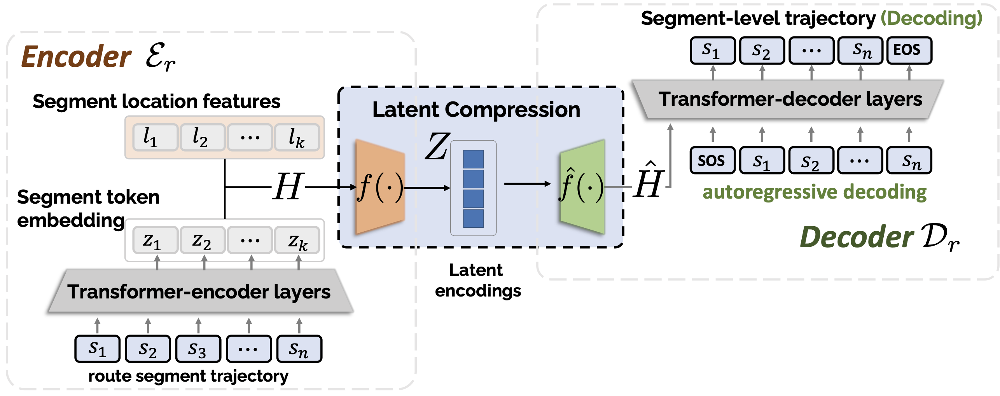

# Discrete-Trajectory-Autoencoder
A discrete trajectory autoencoder based on language modeling

## Description

This repository contains the training scripts for the discrete trajectory autoencoder developed at Cardiff.



In this repository:
- Inspired by language modeling for discrete data, we treat urban mobility trajectory data as a form of language (discrete sequences).
- We first pretrain a basic discrete, road-segment-level trajectory autoencoder based on a BART structure.
- After pretraining, we perform autoencoder compression to obtain denser embeddings of trajectory data.
 
## Setup

### 1. Clone the repository
```
git clone https://github.com/urban-mobility-generation/Discrete-Trajectory-Autoencoder.git
cd Discrete-Trajectory-Autoencoder
```

### 2. Prepare the dataset
Make sure you have prepared the trajectory dataset.  
We will provide a preprocessed public dataset from Porto soon!

## Training

### Pretraining stage
```
nohup python pretrain_mb.py > train_mask_e4d2_mask.log 2>&1 &
```

### Compression stage
```
nohup python train_latent_model_coor.py > trainl16d128_mask_coor_04.log 2>&1 &
```

The trained autoencoder can be used in Cardiff for mobility generation and also has broad applications such as trajectory representation, imputation, and infilling tasks.

## BibTeX

```bibtex
@article{guo2025leveraging,
  title={Leveraging the Spatial Hierarchy: Coarse-to-fine Trajectory Generation via Cascaded Hybrid Diffusion},
  author={Guo, Baoshen and Hong, Zhiqing and Li, Junyi and Wang, Shenhao and Zhao, Jinhua},
  journal={arXiv preprint arXiv:2507.13366},
  year={2025}
}
```

## Acknowledgments

The training pipeline of the compression module is inspired by the following projects:  
- [Latent Diffusion for Language Generation](https://github.com/justinlovelace/latent-diffusion-for-language)  
- [Flamingo](https://github.com/lucidrains/flamingo-pytorch)

We thank the authors for their high-quality implementations and open-source contributions.
